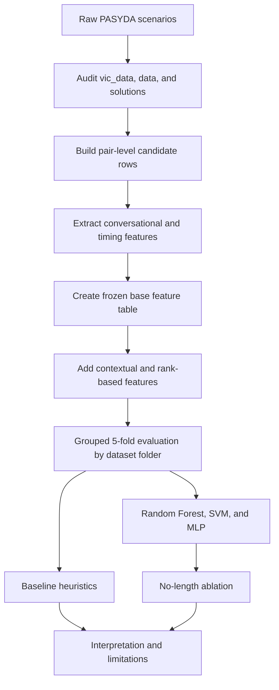
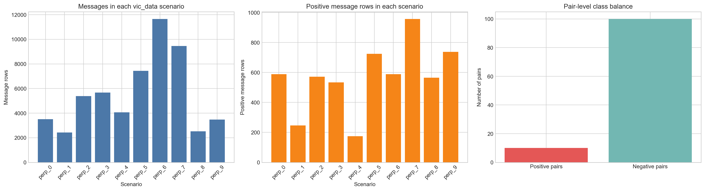
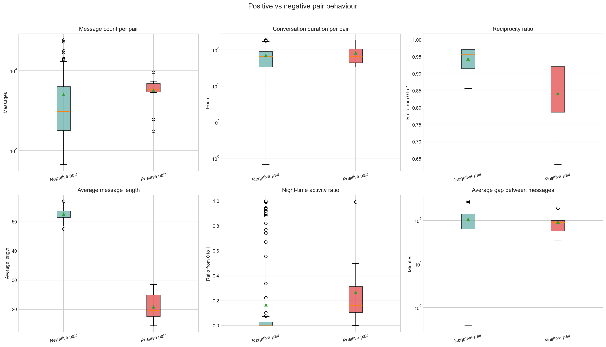
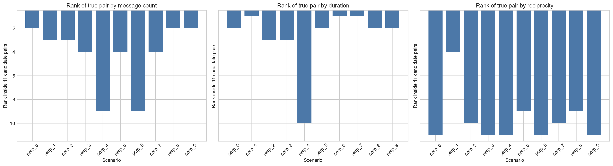
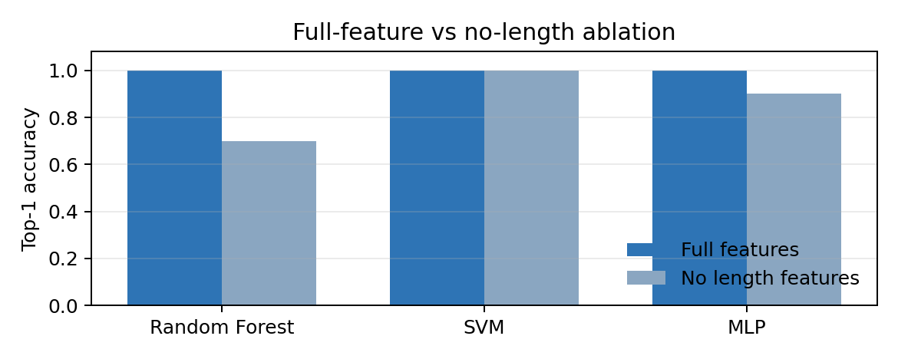

# PASYDA: Synthetic Datasets for Enhancing Online Child Protection from Grooming

PASYDA is a cybersecurity and AI project focused on a practical question: can synthetic metadata help identify grooming-related interaction patterns when raw text is unavailable or unreliable to share?

The repository shows the full project flow from dataset understanding, to pair-level feature engineering, to grouped evaluation and ablation testing. The goal was not just to build a model, but to explain why the task matters, how the pipeline was constructed, what the data actually contains, and what the results mean.

## Project Story

The work started with synthetic grooming scenarios built from the PASYDA datasets. Each scenario contains one true victim-related pair and multiple candidate pairs. The challenge was to turn those scenario files into a proper machine learning problem without leaking information across scenarios.

The project then moved through three stages:

1. Understand the raw scenario structure and verify the data integrity.
2. Build pair-level features that describe message volume, timing, reciprocity, and conversational shape.
3. Evaluate heuristics and models with grouped folds so that entire dataset folders stay separated between train and test.

That flow matters because the strongest result in the project is not just high accuracy. It is the fact that the evaluation was done in a way that matches the actual scenario structure.

## End-to-End Workflow

## What The Data Looks Like

The raw PASYDA scenarios are not used directly as flat training rows. Instead, the project reconstructs the task at pair level:

- each scenario contributes 11 candidate pairs
- exactly 1 pair is positive per scenario
- the final modelling table contains 110 pair-level samples in total
- the class balance is 10 positive pairs and 100 negative pairs

This makes the modelling task more realistic and also more difficult than a simple row-level classification problem.

The exploratory analysis shows that the positive pair often differs from the negatives in ways that are useful for modelling, especially around message length, duration, and time-of-day activity.

## Feature Engineering

The project builds two important feature tables:

- a frozen base pair-level table for the core experiments
- an enhanced table with contextual and rank-based features

The enhanced features add scenario-relative information such as within-scenario ranks, z-scores, short-message ratios, late-night activity, first-day intensity, last-day intensity, and direction-switch frequency.

That design is important because raw counts alone can be misleading when scenarios differ in size and message volume.

More detail is documented in:

- [Results/features/README.md](Results/features/README.md)
- [PASYDA_EDA_Report_Summary.md](PASYDA_EDA_Report_Summary.md)

## Evaluation Strategy

The experiments use grouped 5-fold evaluation by dataset folder.

Each fold holds out one complete dataset folder for testing and trains on the other four. This avoids leakage between rows from the same dataset folder and makes the results more defensible.

The evaluation reports several metrics, including:

- Top-1 Accuracy
- Mean Reciprocal Rank
- Precision at Top-1
- Recall at Top-1
- F1 at Top-1
- ROC-AUC
- PR-AUC

## Main Results

The baseline experiments show that simple volume-based heuristics are not enough, but message-length based heuristics are unusually strong.

The full enhanced feature set gives perfect grouped-evaluation results for Random Forest, SVM, and the small MLP. However, the no-length ablation is the more interesting result for interpretation:

- Random Forest drops from 1.00 to 0.70 Top-1 Accuracy
- MLP drops from 1.00 to 0.90 Top-1 Accuracy
- SVM remains perfect

That pattern suggests the synthetic data contains a strong message-length signal, so the results should be presented as successful on this dataset rather than as proof of general real-world deployment performance.

## What The Project Demonstrates

This repository is useful because it shows three different signals in one portfolio piece:

- build ability: a working feature-engineering and evaluation pipeline
- analysis ability: a careful read of the dataset and the experimental results
- explanation ability: a clean interpretation of what the model can and cannot claim

In short, the project does not just say that a model worked. It explains why the task was built this way, how the data was structured, what the evaluation means, and where the limits are.

## Repository Guide

- `PASYDA/` - original synthetic data package and supporting material
- `Results/` - final analysis outputs, feature tables, and evaluation summaries
- `outputs/` - generated EDA artifacts used to build the final reports
- `reports/` - experiment write-ups and summary documents
- `src/` - feature engineering, evaluation, and reporting code
- `tools/` - helper scripts used to generate documents and summary files
- `PASYDA_EDA_Final.ipynb` - the final notebook used for the EDA workflow
- `PASYDA_EDA_Report_Summary.md` - a readable summary of the notebook and outputs

## Where To Start

If you want the fastest path through the project, read these in order:

1. [PASYDA_EDA_Report_Summary.md](PASYDA_EDA_Report_Summary.md)
2. [Results/features/README.md](Results/features/README.md)
3. [Results/metrics/README.md](Results/metrics/README.md)
4. [reports/experiment_reports/experiment_index.md](reports/experiment_reports/experiment_index.md)
5. [reports/experiment_reports/model_experiments_summary.md](reports/experiment_reports/model_experiments_summary.md)
6. [reports/summary_report/AI%20for%20Cyber%20Security%20Group%20Project%20Report.pdf](reports/summary_report/AI%20for%20Cyber%20Security%20Group%20Project%20Report.pdf)

## Notes

This README is intentionally written as a project walkthrough. It is meant to help a reader understand the whole pipeline from raw scenario files to the final findings without needing to open every intermediate artifact.
